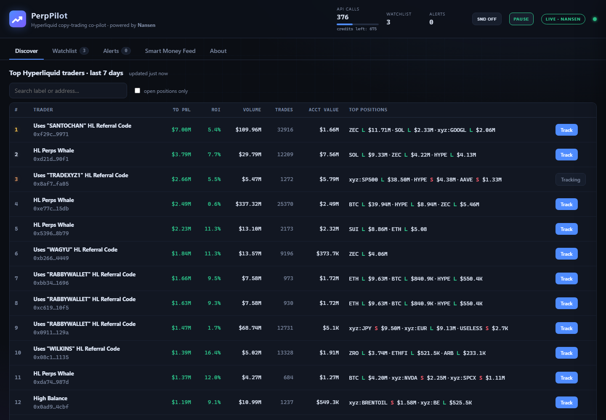

# PerpPilot — Hyperliquid Copy-Trading Co-Pilot

<p align="center"></p>

<p align="center"></p>

Track the most profitable Hyperliquid perpetual traders, see their live positions, win rates and risk,
and get alerted the moment they open, close, flip, add, reduce — or drift near liquidation.
Built on the **Nansen API** for the **Meridian Buildathon**.

 

## Features

- **Discover** — top Hyperliquid perps traders over the last 7 days from Nansen's leaderboard
  (Smart HL Perps Trader cohort), with PnL, ROI, volume and top open positions. One click to track.
- **Watchlist** — for every tracked wallet: 30d **win rate**, **profit factor**, closed PnL,
  avg win/loss, live **risk score** (leverage, liquidation proximity, concentration, margin usage).
- **Alerts** — position-change detection by diffing live positions every poll:
  `OPEN` `CLOSE` `FLIP` `INCREASE` `DECREASE` `NEAR_LIQ` (deduped — fires on entering the danger zone),
  plus **`CONFLUENCE`** flock alerts when 2+ tracked traders open the same side of the same coin within 15 minutes.
- **Consensus strip** — net long/short positioning across your whole watchlist per coin.
- **Smart Money Feed** — live firehose of Nansen-labeled smart money perp trades; tracked traders flagged.
- **Watchlist cards** — 30d equity sparkline per trader.
- **Copy Score (0–100)** — one number answering "who to actually copy": win rate (30 pts), profit factor
  (25 pts), trade count (15 pts), 7d leaderboard ROI momentum (15 pts), minus a risk penalty (15 pts)
  → ELITE / STRONG / MODERATE / WEAK.
- **Copy basket backtest-lite** — blends every tracked trader's 30d closed PnL into one stat:
  "+$X across N trades, Y% blend win rate".
- **Skill by coin** — per-coin win rate & PnL in the trader drawer (no extra API calls — computed from
  already-fetched history).
- **Webhook alerts** — paste a Discord webhook or Telegram bot URL and every alert lands on your phone.
- **Call counter & credits** — the header meter tracks Nansen API calls issued (the buildathon asks for 1,000+)
  and shows credits remaining; the status dot turns red if an API call ever fails. `AUTO_PAUSE_CALLS` in
  `.env` pauses the engine automatically at a call target so you never overshoot credits.
- **Pause switch** — the **PAUSE** button (or `POST /api/pause {"paused": true}`) halts *all* Nansen calls
  (zero credit burn) while keeping the dashboard up with last-known data. Persists across restarts.

## Nansen endpoints used

| Endpoint | Purpose |
| --- | --- |
| `POST /api/v1/perp-leaderboard` | Find top profitable traders (7d, Smart HL Perps Trader cohort) |
| `POST /api/v1/profiler/perp-positions` | Live open positions per tracked wallet (entry/liq/leverage/uPnL) |
| `POST /api/v1/profiler/perp-trades` | 30d trade history → win rate, profit factor, equity curve |
| `POST /api/v1/smart-money/perp-trades` | Smart money trade firehose (2h window) |

## Run it

```powershell
cd perppilot
.\start.bat          # installs deps, opens the browser, starts the server
```

or manually:

```powershell
cd perppilot
python -m pip install -r requirements.txt
copy .env.example .env    # then paste your key into NANSEN_API_KEY
python -m uvicorn app.main:app --port 8317
```

Open http://127.0.0.1:8317

- **Get an API key**: https://app.nansen.ai/auth/agent-setup
- **No key?** The app runs in **DEMO DATA** mode (realistic simulated market) so you can explore the UI.
  It switches to **LIVE · NANSEN** automatically once a key is present in `.env`.
- State lives in `state/` (watchlist + call counter) — delete to reset.
- Stop the server: `Get-NetTCPConnection -LocalPort 8317 -State Listen | ForEach-Object { Stop-Process -Id $_.OwningProcess }`

## Deploy (Render)

The backend is a long-running process, so it needs a real host (Render/Railway/Fly) — not Vercel or GitHub Pages.

1. Push this repo to GitHub (it already is: `TheRealNajim/PerpPilot`)
2. On [render.com](https://dashboard.render.com): **New → Blueprint**, pick the repo — `render.yaml` is detected
3. When prompted, fill the env vars:
   - `NANSEN_API_KEY` — your key (never committed to git)
   - `ACCESS_TOKEN` — any long random string; the dashboard asks for it before granting API access
4. Deploy → open the URL → paste the token once (stored in your browser)

> **Why the token gate?** Every visitor shares your Nansen credits. `ACCESS_TOKEN` locks all `/api/*`
> routes (except the health check) behind a header check. Leave it empty in local development.
> Note: Render's free tier has an ephemeral disk — the watchlist resets on restart/redeploy.

## Troubleshooting

- **"Nansen API credits exhausted" banner** — your key has 0 credits left. Top up at
  https://app.nansen.ai (the buildathon promo gives 2x bonus credits) and the app resumes automatically.
  Meanwhile you can set `DEMO_MODE=1` in `.env` to keep working on the UI with simulated data.
- **Red status dot** — hover it for the last API error (rate limit, bad key, expired key…).

## Architecture

```
app/
  config.py   settings (.env, demo-mode auto-detect)
  nansen.py   Nansen API client: auth, retries, 429/Retry-After handling, call accounting
  engine.py   background loops (intervals configurable via .env, see Poll intervals):
                leaderboard  default 30 min (5 credits)
                positions    default  3 min per tracked trader (1 credit each)
                trades       default  3 min round-robin (1 credit each)
                smart feed   default  5 min (1 credit)
  demo.py     self-contained market simulator used when no API key is set
  main.py     FastAPI REST API + static dashboard
static/       dashboard (vanilla JS + Chart.js)
```

### Credit burn & the 1,000-call requirement

With the default intervals and 3 tracked traders the app burns roughly **2 credits/minute**
(~100/hour), so ~950 credits last about 9 hours of continuous running.
Tune via `.env`: `POLL_POSITIONS_SEC`, `POLL_TRADES_SEC`, `POLL_SMART_SEC`, `POLL_LEADERBOARD_SEC`
(lower them before recording the demo video for snappier alerts, raise them when idling).
The header meter counts every call issued — the buildathon asks for 1,000+; `GET /api/stats`
breaks calls down per endpoint.

## Buildathon checklist

- [x] Built with the Nansen API (4 endpoints)
- [ ] 1,000+ API calls (tracked automatically in the header meter)
- [ ] 30–60s demo video (suggested script: discover top traders → track 3 → alerts fire on open/close →
      open trader drawer showing win rate + risk score → smart money feed)
- [ ] Post on X tagging @nansen_ai + repo link
- [ ] Submit before **Sep 27, 23:59 UTC** → https://nsn.ai/meridian-submit

> Not financial advice. Data by Nansen.

## License

[MIT](LICENSE)
